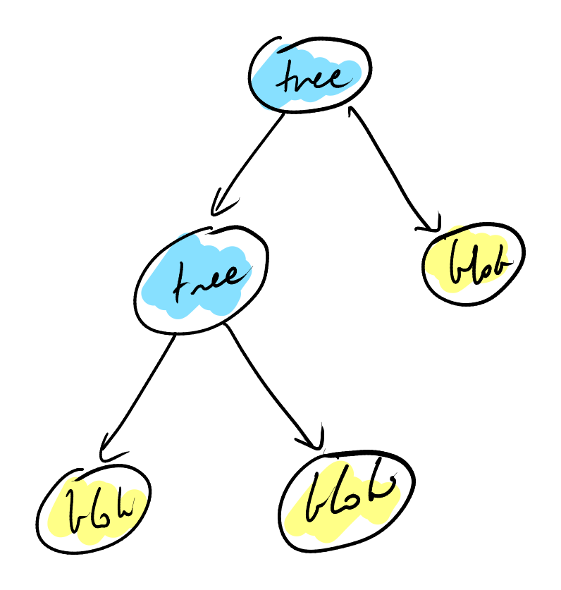
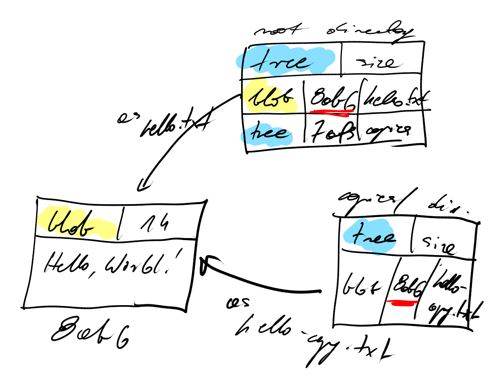
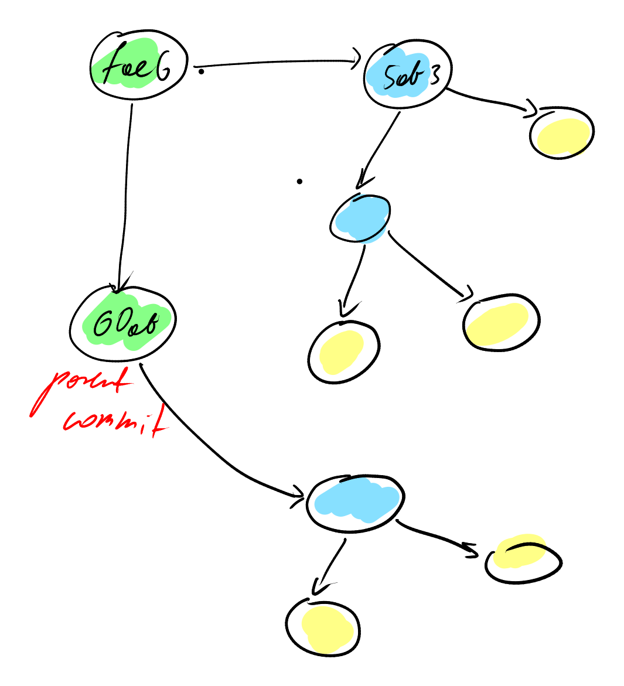
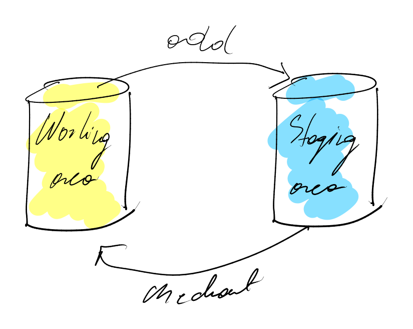
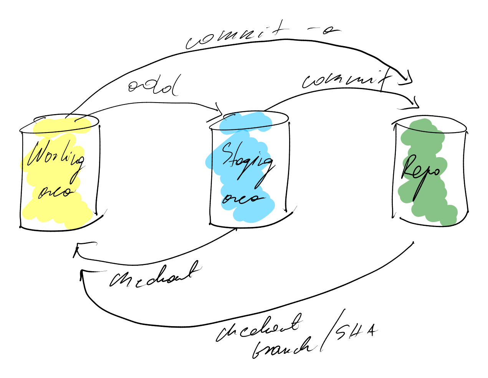
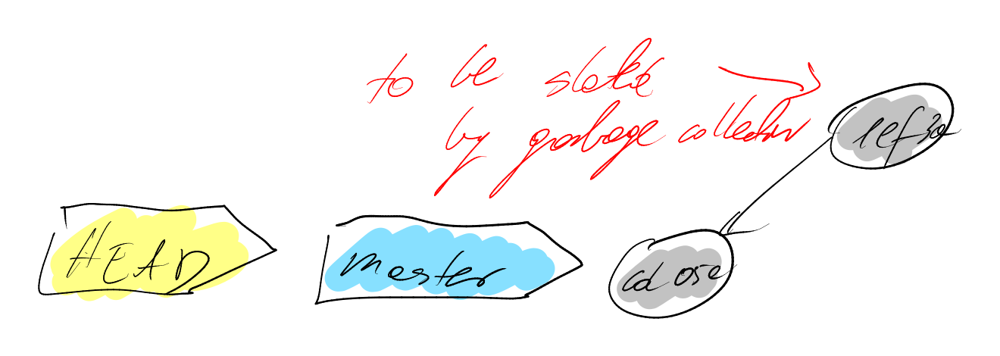

# notatki git

### Git foundations

Basic workflow: main > create a branch to edit > commit changes > pull request > merging > deleting the side branch

data storage: blobs, trees and commits

blob: blob 14\0Hello World!


```
 echo 'Marcin' | git hash-object --stdin
```

> 82c9bd86021e25d2bd61cdfe13b13f5954c94154

```
echo -e 'blob 7\0Marcin' | openssl sha1
```

> 82c9bd86021e25d2bd61cdfe13b13f5954c94154

the same content always gives you the same hash, but the probability of getting the same hash from different data is infinitely small

.git > objects > {first two characters of a blob} > {the rest of characters of the blob}

tree: pointers to blobs or other trees, metadata: type of pointer (blob or tree), filename or directory name, mode (executable file, symbolic link, ...)


staging area - only to keep files, that is why git cannot put them an empty directory

tree - directed graph



The same content the same hash, so even if the same content is in two different places git stores information about that file in one hash, therefore memory is saved



a commit points to a tree and contains metadata: author and committer, date, message, parent commit (one or more) - it all goes to sha1 function




```
git cat-file -t 8ab686
```

returns a type of a git file

```
git cat-file -p 8ab686
```

returns a message stored in a git file

HEAD - a pointer to the current commit

master and any name of the branch is also a pointer to a commit

```
git log
```

returns a history of commits

### Git areas and stashing

Three areas: working area, staging area and repository

The working area - untracked files

The staging area - the files that are going to be part o the next commit

The repository - contains all of your commits

The staging area is how git knows what will change between the current and the next commit

The baseline staging area is an exact copy of the latest commit - so it's never empty

```
git ls-files -s
```

returns a list of files in index (what's in the staging area)

```
git add <file>
```

adds a file to the next commit

```
git rm <file>
```

deletes a file in the next commit

```
git mv <file>
```

renames a file in the next commit





Git stash - saves un-committed work, safe from destructive operations

```
git stash
```

stash changes

```
git stash list
```

list changes

```
git stash show stash@{0}
```

show the contens

```
git stash apply
```

to apply the last stash

```
git stash apply stash@{0}
```

to apply a specific stash

```
git stash --include-untracked
```

to keep untracked files

```
git stash --all
```

to keep all files (even ignored ones!)

```
git stash save "WIP: making progress on foo"
```

to name a stash for a reference

```
git stash branch <branch-name> <optional stash name>
```

to start a new branch from a stash

```
git checout <stash name> -- <filename>
```

to grab a single file from a stash

```
git stash pop
```

to remove the last stash and aplly changes

```
git stash drop
```

to remove the last stash

```
git stash drop stash@{n}
```

to remove the nth stash

```
git stash clear
```

to remove all stashes

## References, commits, branches

Branch - a pointer to a particular commit

The pointer of the current branch changes as new commits are made

HEAD - usually points at the name of the current branch (detached HEAD - points at a commit)

HEAD moves when you make a commitin the currently active branch or when making a checkout

Lightweight tags are just a simple pointer to a commit.

When you create a tag with no arguments, it captures the value in HEAD.

```
git tag
```

to list all the tags in a repo

```
git show-ref --tags
```

to list all tags and what commit they're pointing to

```
git tag --points-at <commit>
```

to list all the tags poinintg to a commit

```
git show <tag-name>
```

to look at the tag or tagged contents

#### Tags vs branches

The current branch pointer moves with every commit to the repository. The commit that a tag points does not chane - it's a snapshot.

#### Head-less / detached head

We can make our HEAD pointing to a commit out of our branch - it is a useful way to experiment, try new things.


To save our work we can create a new branch that points to the last commit we made in a detached state. 

```
git branch <new-branch-name> <commit>
```

Why the last commit - because the other commits point to their parents.

If we do not point a new branch at those commits they will no longer be referenced in git (dangling commits). Eventually they will be garbage collected.


